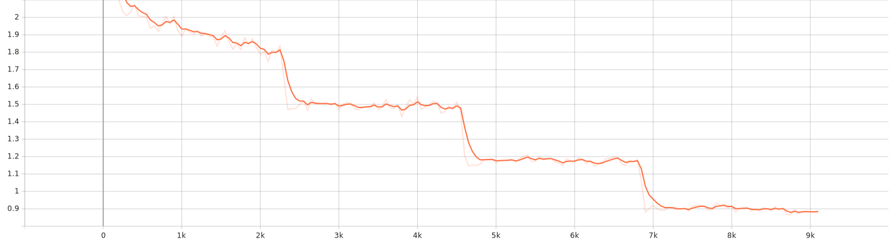
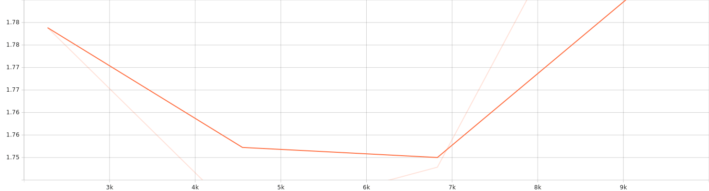

# Image Captioning — BLIP (Fine‑Tuning & Evaluation)

> Lightweight, pragmatic fine‑tuning and evaluation pipeline around **Salesforce BLIP** for image captioning. Uses Hugging Face **Transformers** and **Datasets**, with a clean modular layout and a single‑file inference helper.

<p align="center">
  
  
  
  
</p>

---

## Why this repo

- **End‑to‑end**: Train ➜ evaluate ➜ export ➜ run inference with a couple of functions.
- **Sane defaults**: BLIP base model, Flickr8k by default; optional COCO‑Karpathy split.
- **Minimal surface area**: A small, readable codebase that’s straightforward to extend or productionize.
- **Metrics you actually care about**: BLEU during training, COCO‑style metrics (CIDEr/METEOR/SPICE) post‑training.

If you’re looking for a “batteries included” library, see LAVIS. If you want a focused, no‑frills training script that you can own and reason about, you’re in the right place.

---
## Repository structure
<details>
<summary><code>blip_caption/</code> package structure</summary>

```text
Image-Captioning-BLIP/
├─blip_caption/
│  ├── __init__.py
│  ├── collator.py        # batch collation with BLIP processor
│  ├── config.py          # defaults: model, data, training, generation, metrics
│  ├── data.py            # dataset loading (e.g., Flickr8k / COCO-Karpathy)
│  ├── inference.py       # single-image caption helper
│  ├── metrics.py         # BLEU during training; COCO-style post-train metrics
│  ├── modeling.py        # model/processor builders (BLIP base by default)
│  ├── training.py        # HF TrainingArguments + Trainer wiring
│  └── main_train.py      # end-to-end train→evaluate→export entrypoint
├─ sagemaker/
│  ├─ train_blip.py              # Training entrypoint (HF Trainer on BLIP)
│  ├─ inference.py               # SageMaker PyTorch model server handlers
│  ├─ launch_training.py         # Create & run a SageMaker training job
│  ├─ deploy_endpoint.py         # Create a real-time endpoint (or batch)
│  ├─ requirements.txt           # Pinned libs for training/inference in DLC
│  └─ README_SAGEMAKER.md        # One-page runbook for teammates
├─ tests/
│  └─ test_inference_handler.py  # Smoke test for inference handlers
└─ .github/workflows/ci.yaml     # Lint + unit test 
```
</details>


---
## 🚀 Model on Hugging Face

[](https://huggingface.co/Amirhossein75/Image-Captioning-Blip)

<p align="center">
  <a href="https://huggingface.co/Amirhossein75/Image-Captioning-Blip">
    
  </a>
</p>

---

## TL;DR – quick start

```bash
# 1) Create and activate an environment
python -m venv .venv && source .venv/bin/activate  # On Windows: .venv\Scripts\activate

# 2) Install dependencies
pip install --upgrade pip
pip install torch torchvision --index-url https://download.pytorch.org/whl/cu121  # adjust for your CUDA/OS
pip install transformers datasets evaluate tensorboard sacrebleu pillow numpy
# For COCO metrics (optional; needed for CIDEr, METEOR, SPICE):
pip install pycocotools pycocoevalcap

# 3) Train (defaults: Flickr8k, BLIP base)
python -m blip_caption.main_train
```

> **Note**: COCO metrics run after training on the validation split and are written to `blip-open-out/coco_metrics.json`. If SPICE throws a Java error, see **Troubleshooting** below.

---

### Defaults worth knowing

`blip_caption/config.py` is a set of `@dataclass` blocks you can treat like a single config object:

- **Model & outputs**
  - `paths.model_id`: `"Salesforce/blip-image-captioning-base"`
  - `paths.output_dir`: `"blip-open-out"`

- **Data**
  - `data.use_dataset`: `"flickr8k"` or `"coco_karpathy"`
  - Flickr8k HF id: `ariG23498/flickr8k`
  - COCO‑Karpathy HF id: `yerevann/coco-karpathy`
  - Repro seed: `42`
  - Flickr8k split recipe: 90% train / 5% val / 5% test (random, deterministic by seed)

- **Training**
  - Epochs: `4`, LR: `5e-5`, per‑device batch size: `8` (train & eval), gradient accumulation: `2`
  - Gradient checkpointing: `True`
  - Freeze vision encoder: `False` (set `True` for lighter fine‑tuning)
  - Logging every `50` steps, keep `2` checkpoints
  - Early selection by `"sacrebleu"` best metric

- **Generation (inference/eval)**
  - `max_txt_len`: `40`, `gen_max_new_tokens`: `30`, `num_beams`: `5`, `length_penalty`: `1.0`, `early_stopping`: `True`

- **COCO metrics**
  - `do_spice`: `True` (requires Java), `spice_subsample`: `1500` (speeds things up), JSON output enabled

> **Pro tip**: No CLI yet—tweak anything in `config.py` (or copy the dataclasses into your own script and pass a custom config into the builders).

---

## Training & evaluation

### 1) Train
`main_train.py` does the heavy lifting:
- Sets seeds for reproducibility.
- Loads the dataset according to `data.use_dataset`.
- Builds processor + model (with optional vision freezing).
- Wires an HF `Trainer` with a custom collator and a BLEU compute function.
- Trains and prints the **best BLEU** seen during training.

Run:
```bash
python -m blip_caption.main_train
```

### 2) COCO‑style metrics (post‑train)
After training, `main_train.py` decodes validation captions and computes:
- **CIDEr**, **METEOR**, **SPICE** (optional), and **BLEU‑4** summary
- Writes a compact `blip-open-out/coco_metrics.json`

> SPICE can be slow and needs Java; set `coco.do_spice=False` if you don’t need it for a quick pass.

---

## Inference

Use the tiny helper to caption a single local image with any BLIP checkpoint (pretrained or your fine‑tuned export):

```python
from transformers import BlipProcessor, BlipForConditionalGeneration
from blip_caption.inference import caption_image

# Load either your trained artifacts or a pretrained BLIP:
processor = BlipProcessor.from_pretrained("blip-open-out")  # or "Salesforce/blip-image-captioning-base"
model = BlipForConditionalGeneration.from_pretrained("blip-open-out")

print(caption_image("path/to/image.jpg", processor, model, max_new_tokens=30, num_beams=5))
```

You can also point both `from_pretrained` calls to `"Salesforce/blip-image-captioning-base"` for quick zero‑shot captions.

---

## Design notes (what’s under the hood)

- **Data** (`data.py`)
  - Flickr8k: loaded from HF Datasets, split into 90/5/5 with a seed for determinism. We cast `image` to a deferred `Image` feature to inject a stable `image_id` from filenames, then decode on demand.
  - COCO‑Karpathy: uses the community HF dataset. We keep the standard columns (`image`, `caption`, `image_id`) and normalize the records (when captions are lists, we sample one per example for supervision).

- **Collation** (`collator.py`)
  - Uses `BlipProcessor` to tokenize text and process images in one shot, returns `pixel_values`, `input_ids`, `attention_mask`, and `labels` where pad tokens are masked to `-100`.

- **Modeling** (`modeling.py`)
  - BLIP base (ViT‑B/16 backbone) via `BlipForConditionalGeneration`. Optional “freeze vision” switch for parameter‑efficient fine‑tuning.

- **Training** (`training.py`)
  - Standard `TrainingArguments` + `Trainer` with BLEU compute function (via `evaluate`/`sacrebleu`). Logging to TensorBoard out of the box. Checkpoint churn is capped.

- **Metrics** (`metrics.py`)
  - Post‑training evaluation computes COCO‑style metrics. SPICE is behind a toggle and sub‑samples to keep runtime reasonable in local setups.

---

## Reproducibility

- `seed_utils.set_seed` seeds Python, NumPy, and PyTorch RNGs.
- When using CUDA, you’ll get stable results *per hardware/driver combo*; minor variance across GPUs is normal in practice.
- For bit‑for‑bit determinism, also set `CUBLAS_WORKSPACE_CONFIG=:16:8` or `:4096:8` and disable certain CuDNN autotune knobs (not wired here by default).

---


### 📉 Loss Curve

The following plot shows the training loss progression:



The following plot shows the validation loss progression:


*(SVG file generated during training(by tensorboard logs) and stored under `assets/`)*

## 🖥️ Training Hardware & Environment

- **Device:** Laptop (Windows, WDDM driver model)  
- **GPU:** NVIDIA GeForce **RTX 3080 Ti Laptop GPU** (16 GB VRAM)  
- **Driver:** **576.52**  
- **CUDA (driver):** **12.9**  
- **PyTorch:** **2.8.0+cu129**  
- **CUDA available:** ✅ 


## 📊 Training Logs & Metrics

- **Total FLOPs (training):** `86,423,848,150,821,240,000`  
- **Training runtime:** `7,141.1743` seconds  
- **Logging:** TensorBoard-compatible logs in `blip_caption/.../logs`  

You can monitor training live with:

```bash
tensorboard --logdir blip_caption/.../logs
```
### 🏆 Results (Test Split)

<p align="center">
  
  
  
  
</p>

| Metric    | Score |
|-----------|------:|
| BLEU‑4    | **0.9708** |
| METEOR    | **0.7888** |
| CIDEr     | **9.3330** |
| SPICE     | — |

<details>
<summary>Raw JSON</summary>

```json
{
  "Bleu_4": 0.9707865195383757,
  "METEOR": 0.7887653835397767,
  "CIDEr": 9.332990983959254,
  "SPICE": null
}
```
</details>
---
### 🔁 Reproduce

```bash
# Train & evaluate with repo defaults
python -m blip_caption.main_train

# COCO metrics (including CIDEr, METEOR, and optionally SPICE) are saved to:
cat blip-open-out/coco_metrics.json
```

---
## AWS SageMaker

A complete SageMaker recipe is provided in [`sagemaker/README_SAGEMAKER.md`](sagemaker/README_SAGEMAKER.md). It explains how to:
- set up the environment in SageMaker Studio or a notebook instance,
- stage datasets in Amazon S3,
- launch a training job for BLIP,
- and download model checkpoints/artifacts for inference.

## GPU & memory guidance

- **BLIP base** comfortably trains on a **single 16GB GPU** with the defaults (gradient checkpointing helps). If you’re short on memory:
  - Set `freeze_vision=True`.
  - Lower `per_device_train_bs` and/or increase `grad_accum_steps`.
  - Consider enabling 8‑bit Adam (`bitsandbytes`) or LoRA if you need more headroom (not included here).

---

## Troubleshooting

**COCO/SPICE errors (Java required)**  
- Install Java 8+ (OpenJDK is fine). On Ubuntu:
  ```bash
  sudo apt-get update && sudo apt-get install -y default-jre
  java -version  # should print something like "1.8.x" or "11.x"
  ```
- Re‑run; the first SPICE evaluation downloads Stanford CoreNLP assets into a cache folder.  
- If you don’t need SPICE, set `coco.do_spice=False` in `config.py`.

**PyTorch + CUDA**  
- Always install the **CUDA‑matched** wheel from the PyTorch download page. A mismatched runtime is the #1 source of perf/installation issues.

**HF Datasets timeouts**  
- The first run will cache data in `~/.cache/huggingface/datasets`. Use `HF_DATASETS_CACHE=/custom/path` if you need to relocate it.

---

## Acknowledgments & references

- **BLIP paper**: *Bootstrapping Language‑Image Pre‑training for Unified Vision‑Language Understanding and Generation*, Li et al., 2022.  
- **Salesforce BLIP model cards** (Hugging Face).  
- **Official BLIP code** (Salesforce Research).  
- **LAVIS**: a general library for language‑vision models built by Salesforce Research.

---

## Citation

If you use this codebase in academic work, please cite BLIP:

```bibtex
@misc{li2022blip,
  title  = {BLIP: Bootstrapping Language-Image Pre-training for Unified Vision-Language Understanding and Generation},
  author = {Li, Junnan and Li, Dongxu and Xiong, Caiming and Hoi, Steven},
  year   = {2022},
  eprint = {2201.12086},
  archivePrefix = {arXiv}
}
```

---
